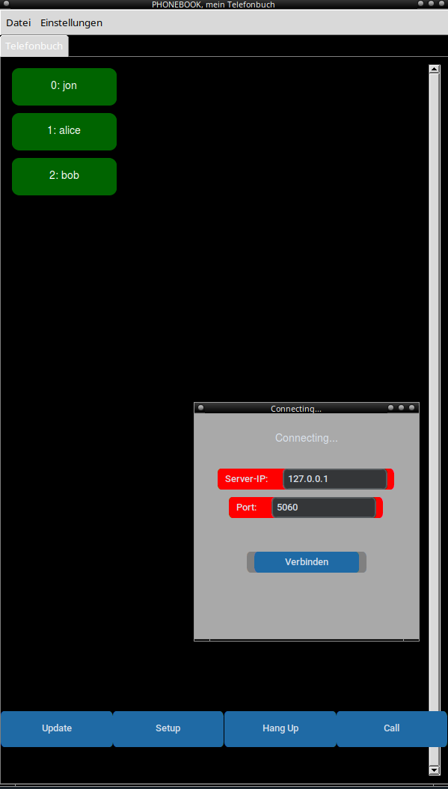

# sichere leitung

screenshot, setup:

# kurz und einfach
gcc -shared -fPIC -o auslagern.so auslagern.c \
    -O2 -fstack-protector-strong \
    -D_FORTIFY_SOURCE=2 \
    -Wl,-z,now,-z,relro,-z,noexecstack

___________________________________________________
linux/unix/bsd:    
python3 server.py  
python3 client.py  
___________________________________________________
