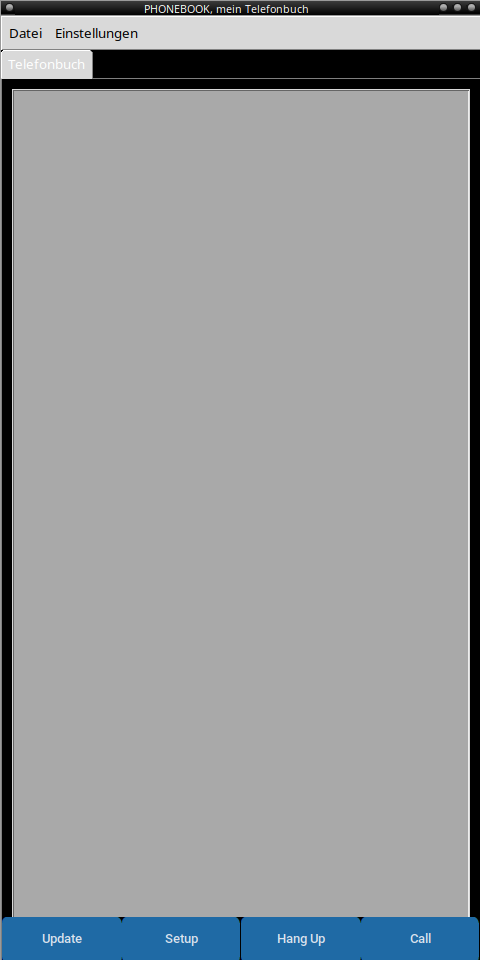

# sichere leitung

screenshot, setup:

# kurz und einfach
gcc -shared -fPIC -o auslagern.so auslagern.c \
    -O2 -fstack-protector-strong \
    -D_FORTIFY_SOURCE=2 \
    -Wl,-z,now,-z,relro,-z,noexecstack

___________________________________________________
linux/unix/bsd:    
python3 server.py  
python3 client.py  
___________________________________________________  
# TODO
1. "Call", die bidirektionale Audioübertragung testen und gegebenfalls korrigieren.  (Funktioniert noch nicht!)  
2. review der thread sicherheit, gegebenfalls ein fix. 
___________________________________________________  

# FINISHED  
1. (die aller-meisten)Sicherheits Funktionen sind fertig.  
2. User Interface  
3. "Setup" -> verbindet erfolgreich  
4. "Update" -> Telefonbuch update und Identitäts-session erfolgreich  
5. Mehrere clients threadsafe verwalten. Auf 2 ports 5060/5061  - braucht review, das meiste funktioniert.

# Sicherheitswarnungen
Sicherheit ist kein Absolutismus,    
Einschränkungen der Sicherheit können unter anderem eintreten, wenn:  
-> Die Soundkarte, bzw. der Soundkartentreiber kompromittiert ist. [KRITISCH]  
-> Die Entropie des Systems kompromittiert ist. [UNKRITISCH]  
-> Das System einen Trojaner/rootkit implementiert. [kann aber gesehen werden mit access_monitor.py]  
-> Andere Eingabe und Ausgabe Schnittstellen kompromittiert sind. -> Hardware treiber...[KRITISCH]  
-> Wenn der Nutzer seinen privaten Schlüssel preis gibt. [KRITISCH]  
-> ...  code injection ...  -> mit Cython kompilieren schützt -> Kopierschutz.  [KRITISCH JE NACH SYSTENUMGEBUNG]
keine Gewähr. Enjoy <3

